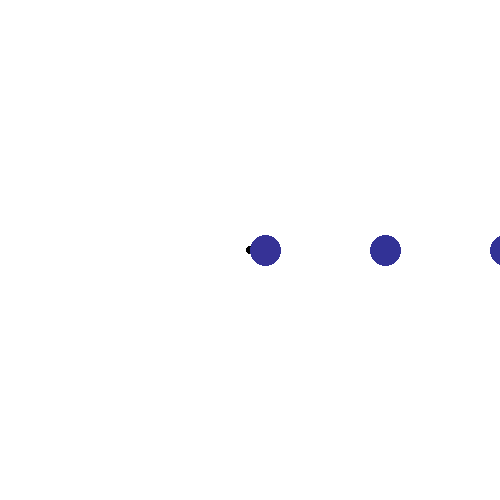

# NEAT Brachiation

## About

Teaching a Gibbon (accurately modeled as a spring and mass) to swing between branches (equally spaced circles) using a custom implmentation of NEAT (neural evolution of augmenting topologies) in Python.

## Read More

-   [More Info](https://charlieberens.org/projects/brachiation)
-   [NEAT Implementation](https://github.com/charlieberens/neat)

## Look at him Go

